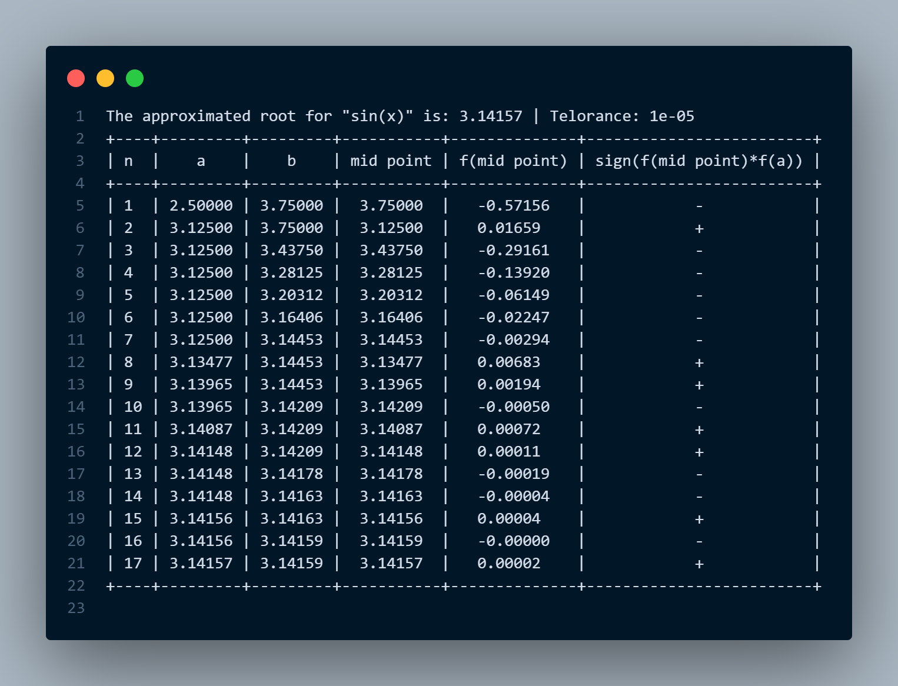

# Bisection Method for Finding Roots of Equations

This project implements the Bisection Method to find roots of equations in one variable. The Bisection Method is a numerical method that repeatedly bisects an interval and selects a subinterval in which a root must lie.

## Table of Contents

- [Installation](#installation)
- [Usage](#usage)
- [Algorithm](#algorithm)
- [Example](#example)
- [License](#license)

## Installation

Clone this repository to your local machine.
```
git clone https://github.com/KuroshNazari/Bisection-Method.git
```

To run this program, you need to have Python installed on your machine. You also need to install the following libraries:

- `sympy` for symbolic mathematics
- `matplotlib` for plotting graphs
- `numpy` for numerical operations
- `prettytable` for displaying results in a table format


You can install these packages using pip:

```bash
pip install sympy prettytable matplotlib numpy
```

or

```
pip install -r requirements.txt
```


## Usage

1. Run the script.
2. Input the equation you want to solve in terms of `x` (e.g., `x**2 - 4`, `exp(x)` or `sin(x)`).
3. Specify the interval (e.g., `(0, 5)`) to search for a root.
4. Confirm if you're satisfied with the plot showing the function and the specified interval.
5. The program will then perform the Bisection Method to find and print the approximated root.

## Algorithm

To begin, set a1 = a and b1 = b, and let p1 be the midpoint of [a, b]; that is, `m1 = (a1 + b1)/2`
1.  If `f(m1) = 0`, then `m = m1`, and we are done.
2.  If `f(m1) ≠ 0`, then `f(m1)` has the same sign as either `f(a1)` or `f(b1)`.
    - If `f(m1)` and `f(a1)` have the same sign, `m ∈ ( m1, b1)`. Set `a2 = m1` and `b2 = b1`.
    - If `f(m1)` and `f(a1)` have opposite signs, `m ∈ (a1, m1)`. Set `a2 = a1` and `b2 = m1`.
3.  we can select a tolerance `ε > 0` and generate `m1, ... , mN` until one of the following conditions is met:
    - If `|m_N - m_N-1| < ε`
    - If `|f(m_N)| < ε`
    - If `|m_N - m_N-1|/|m_N| < ε` and `m ≠ 0`


## Example

To use the Bisection Method, you can create an instance of the `BisectionMethod` class and call the `solve()` method:

```python
b = BisectionMethod(max_iteration=100, epsilon=0.00001, stopping_procedures=3)
b.solve()
```
Below is an example of the output:


If the bisection fails to approximate the root, the program will output a failure message.


## License

This project is open source and available under the [MIT License](LICENSE).

---

Feel free to adjust the details as necessary to align with your coding style or specific project requirements!